# CPS-289: SPIKE — Architecture & Integration Design for Biometric Transaction Authentication

**Parent:** CPS-91 — Core Platform Shared

**Jira:** [CPS-289](https://svi-jira.atlassian.net/browse/CPS-289) · **Depends on:** CPS-220 (OCR), CPS-221 (Face Matching), CPS-222 (Liveness)

**Goal:** Design a secure, plug-and-play architecture for injecting a biometric transaction authentication step into client applications — enabling face verification before high-value actions (money transfers, benefit claims, etc.) without exposing core identity data to client systems.

---

## Executive Summary

| Priority | Architecture Option | Why | Est. Effort |
|----------|---------------------|-----|-------------|
| **🥇 Recommended** | **Iframe Widget + Backend Session API** | Client embeds a secure iframe pointing to our hosted widget. Session token binds transaction details to biometric check. No client-side access to identity data. Updates are instant for all clients. | 4-6 weeks |
| **🥈 Alternative** | **Web Component / Custom Element** | Client drops a `<biometric-auth>` tag. Slightly more flexible than iframe but requires more client integration effort. | 6-8 weeks |
| **🥉 Fallback** | **Redirect Flow** | Client redirects to our hosted page, then we redirect back with a signed payload. Simplest integration, worst UX. | 2-3 weeks |

---

## Table of Contents

1. [Objective & Business Context](#1-objective--business-context)
2. [High-Level Concept & User Flow](#2-high-level-concept--user-flow)
3. [Architecture Overview](#3-architecture-overview)
4. [Integration Strategy: The "Plugin" Interface](#4-integration-strategy-the-plugin-interface)
5. [Security Architecture](#5-security-architecture)
6. [Mobile Compatibility](#6-mobile-compatibility)
7. [Ease of Maintenance & Invisible Updates](#7-ease-of-maintenance--invisible-updates)
8. [Leveraging Existing POC Work](#8-leveraging-existing-poc-work)
9. [Security Risk Assessment](#9-security-risk-assessment)
10. [Step-by-Step Data Flow Map](#10-step-by-step-data-flow-map)
11. [Interactive Prototype Plan](#11-interactive-prototype-plan)
12. [Comparison Matrix](#12-comparison-matrix)
13. [POC Plan](#13-poc-plan)
14. [References](#14-references)

---

## 1. Objective & Business Context

### The Problem

Our clients need to verify a user's identity at the moment of a high-value transaction (money transfer, benefit claim, account takeover recovery) — but they cannot access our core identity database directly. Any integration must:

1. **Prevent identity data leakage** — client apps must never see raw biometric templates or PII
2. **Be plug-and-play** — clients should add our verification step with minimal code changes
3. **Support invisible updates** — we can change the UI or fix bugs without client redeployment
4. **Bind the check to the transaction** — prevent replay attacks where a valid face check is reused for a different transaction

### Business Value

| Metric | Impact |
|--------|--------|
| **Fraud reduction** | Prevents account takeover during high-value transactions |
| **Client onboarding speed** | Plug-and-play widget reduces integration from weeks to days |
| **Operational cost** | Centralized updates eliminate per-client maintenance |
| **Compliance** | Audit trail per transaction with biometric proof |

---

## 2. High-Level Concept & User Flow

### The "Middleman" Architecture

Client apps never access our core identity data directly. Instead, we host the biometric verification securely on our side and expose a lightweight integration surface.

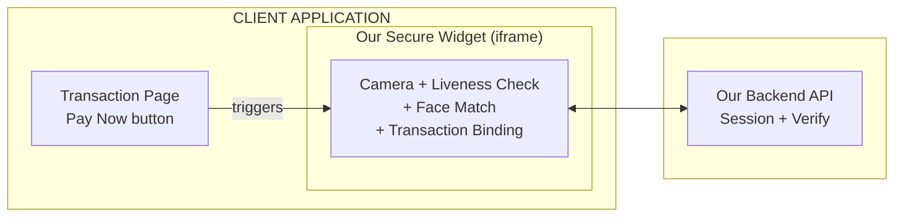

### User Flow (Detailed)

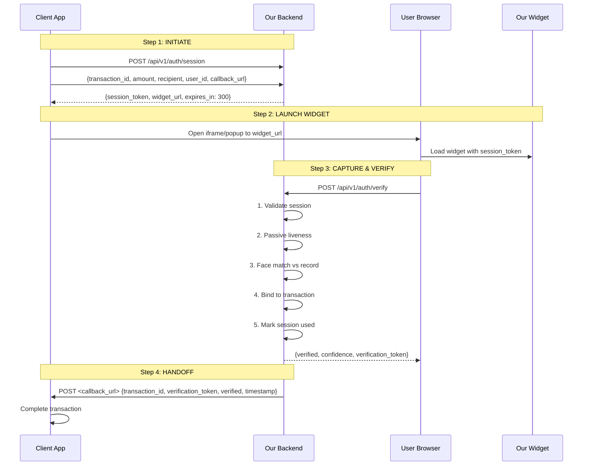

---

## 3. Architecture Overview

### 3.1 System Architecture

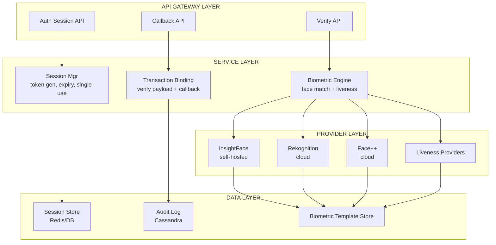

### 3.2 Widget Architecture (Frontend)

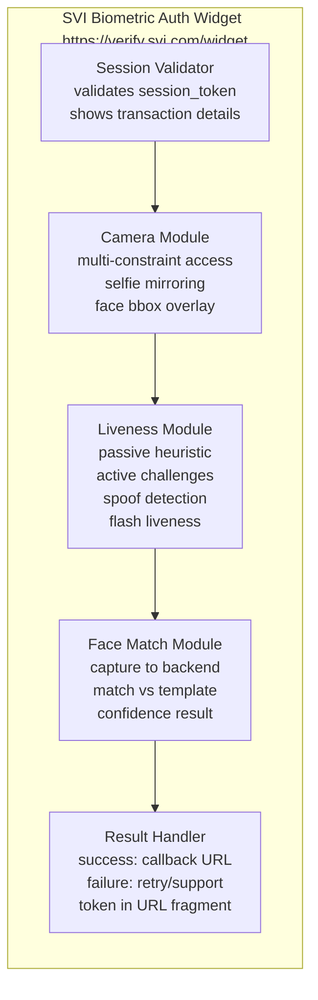

### 3.3 Backend API Design

| Endpoint | Method | Purpose | Request | Response |
|----------|--------|---------|---------|----------|
| `/api/v1/auth/session` | POST | Create a biometric auth session | `{transaction_id, amount, recipient, user_id, callback_url, expires_in}` | `{session_token, widget_url, expires_at}` |
| `/api/v1/auth/verify` | POST | Submit biometric verification | `{session_token, face_image (base64), liveness_data}` | `{verified, confidence, verification_token}` |
| `/api/v1/auth/status` | GET | Check session status | `?session_token=...` | `{status, verified, expires_at}` |
| `/api/v1/auth/cancel` | POST | Cancel a pending session | `{session_token, reason}` | `{cancelled: true}` |

---

## 4. Integration Strategy: The "Plugin" Interface

### 4.1 Recommended: Iframe Widget

**How it works:** Client embeds a simple `<iframe>` pointing to our hosted widget URL. The iframe communicates with the parent page via `postMessage` API.

**Client integration code:**

```html
<!-- Client's transaction page -->
<button id="verify-btn">Verify Identity to Continue</button>

<!-- Step 1: Client backend calls our API to get session token -->
<script>
async function startVerification() {
  const response = await fetch('https://api.svi.com/api/v1/auth/session', {
    method: 'POST',
    headers: { 'Authorization': 'Bearer <client_api_key>', 'Content-Type': 'application/json' },
    body: JSON.stringify({
      transaction_id: 'TXN-001',
      amount: 15000.00,
      recipient: 'ACC-12345',
      user_id: 'USR-789',
      callback_url: 'https://client.com/api/verify-callback'
    })
  });
  const { session_token, widget_url } = await response.json();
  openWidget(widget_url);
</script>

<!-- Step 2: Open the widget in a modal/overlay -->
<div id="svi-verify-modal" style="display:none; position:fixed; inset:0; z-index:99999; background:rgba(0,0,0,0.7);">
  <iframe id="svi-verify-iframe"
    src=""
    style="width:100%;max-width:480px;height:700px;border:none;border-radius:16px;margin:auto;display:block;position:relative;top:50%;transform:translateY(-50%);"
    allow="camera;microphone"
    sandbox="allow-scripts allow-same-origin allow-forms">
  </iframe>
</div>

<script>
function openWidget(url) {
  const modal = document.getElementById('svi-verify-modal');
  const iframe = document.getElementById('svi-verify-iframe');
  iframe.src = url;
  modal.style.display = 'block';
}

// Listen for verification result
window.addEventListener('message', (event) => {
  if (event.origin !== 'https://verify.svi.com') return;
  const { type, payload } = event.data;
  if (type === 'SVI_VERIFICATION_COMPLETE') {
    closeWidget();
    fetch('/api/complete-transaction', {
      method: 'POST',
      body: JSON.stringify({ verification_token: payload.verification_token })
    });
  } else if (type === 'SVI_VERIFICATION_FAILED') {
    showError(payload.reason);
  }
});
</script>
```

**Pros:**
- **Maximum security** — client cannot access our DOM, camera stream, or identity data
- **Invisible updates** — we update the widget on our server, all clients get it instantly
- **Simple integration** — one `<iframe>` tag + one `postMessage` listener
- **Cross-framework** — works with React, Vue, Angular, vanilla JS, mobile WebViews

**Cons:**
- **Limited customization** — client cannot restyle the widget (by design — prevents phishing)
- **Cross-origin communication** — requires `postMessage` handling
- **Mobile WebView quirks** — camera permissions in iframes need testing on iOS/Android

### 4.2 Alternative: Web Component / Custom Element

**How it works:** Client drops a `<biometric-auth>` custom element on their page. The element loads our SDK from a CDN and handles everything internally.

```html
<!-- Client's page -->
<script src="https://verify.svi.com/sdk/biometric-auth.js" async></script>

<biometric-auth
  session-token="st_xxxx"
  transaction-id="TXN-001"
  amount="₱15,000.00"
  recipient="ACC-12345"
  on-verified="handleVerified(event)"
  on-failed="handleFailed(event)"
  on-cancelled="handleCancelled(event)"
  style="width:100%;max-width:480px;height:700px;">
</biometric-auth>

<script>
function handleVerified(event) {
  const { verification_token } = event.detail;
  fetch('/api/complete-transaction', {
    method: 'POST',
    body: JSON.stringify({ verification_token })
  });
}
</script>
```

**Pros:**
- **Native feel** — renders as part of the client's DOM (no iframe boundary)
- **Attribute-driven API** — declarative, framework-agnostic
- **Event-driven** — standard DOM events for result handling

**Cons:**
- **Less secure** — client has DOM access (could theoretically inspect internals)
- **More integration effort** — client must load our SDK script
- **Versioning** — SDK updates require client to update script version (or use CDN with cache-busting)

### 4.3 Fallback: Redirect Flow

**How it works:** Client redirects the user to our hosted verification page, then we redirect back with a signed payload.

```html
<!-- Client's page -->
<a href="https://verify.svi.com/check?session_token=st_xxxx&redirect_uri=https://client.com/callback">
  Verify Identity
</a>
```

**Pros:**
- **Simplest integration** — just a link/redirect
- **No iframe/WebView issues** — works in any browser
- **No cross-origin problems** — standard HTTP redirects

**Cons:**
- **Worst UX** — full page navigation, context switch
- **No inline embedding** — user leaves the client app
- **Session timeout** — redirect must complete within token expiry

---

## 5. Security Architecture

### 5.1 Session Token Design

```
Session Token Structure
=======================

Format: JWT (signed, not encrypted — payload is public)

Header:  { "alg": "HS256", "typ": "JWT" }

Payload: {
  "jti": "st_<uuid>",          // Unique token ID
  "sub": "USR-789",            // User being verified
  "txn": "TXN-001",            // Transaction ID
  "amount": 15000.00,          // Transaction amount
  "recipient": "ACC-12345",    // Recipient account
  "iat": 1712345678,           // Issued at
  "exp": 1712345978,           // Expires (5 min default)
  "usage": 0,                  // Usage counter (max 1)
  "client_id": "CLIENT-001"    // Which client app
}

Signature: HMAC-SHA256(base64url(header) + "." + base64url(payload), server_secret)
```

### 5.2 Security Controls

| Control | Implementation | Source |
|---------|---------------|--------|
| **Single-use tokens** | JWT `jti` stored in Redis with TTL. On first use, mark as consumed. Subsequent uses rejected. | CPS-221 pattern |
| **Short expiry** | Default 5 minutes (configurable per client). Reduces window for replay. | OWASP best practice |
| **Transaction binding** | `amount` + `recipient` hashed into session token. Widget displays these for user confirmation. Backend verifies match on callback. | Prevents amount/recipient swap |
| **Callback signing** | Verification payload signed with client-specific secret. Client verifies signature before acting. | HMAC-SHA256 |
| **Rate limiting** | Per client_id, per user_id, per IP. Max 3 failed attempts per session. | Redis-based sliding window |
| **CORS + CSP** | Widget only loads from our domain. `Content-Security-Policy` restricts script sources. | HTTP headers |
| **Iframe sandbox** | `sandbox="allow-scripts allow-same-origin"` — no popups, no form submission, no navigation | HTML attribute |
| **Camera permission** | Requested only after user clicks "Start" — not on page load. Permission revoked after session. | Browser API |
| **Image integrity** | Image signed with session token before transmission. Backend verifies signature matches. | HMAC per-image |

### 5.3 Tamper-Proofing the Image Pipeline

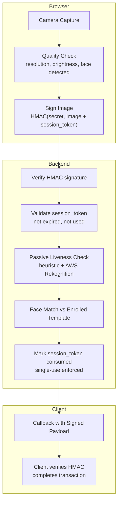

### 5.4 Liveness Validation Strategy

Leveraging the existing POC work from CPS-222, we implement a **layered liveness approach**:

| Layer | Method | Provider | Cost | Detection Target |
|-------|--------|----------|------|------------------|
| **1. Passive (pixel)** | 8-metric heuristic analysis (blur, edges, color variance, histogram, FFT, highlights, moire, banding) | `liveness_passive.py` (NumPy/PIL) | $0 | Printed photo, screen replay |
| **2. Spoof objects** | AWS Rekognition `DetectLabels` — scan for phone, screen, hand, photo frame | AWS Rekognition | $0.001 | Presentation attack (phone holding photo) |
| **3. Active challenges** | Random head-turn challenges (left, right, up, down) + blink detection | Browser-side (face-api.js landmarks) | $0 | Pre-recorded video, deepfake |
| **4. Flash liveness** | RGB screen flash — measure color channel response | Browser-side | $0 | Screen replay, high-quality print |

**Fallback chain:** Passive -> if confidence < 0.7, add Spoof Objects -> if still uncertain, add Active Challenges -> if still uncertain, fall back to human review.

---

## 6. Mobile Compatibility

### 6.1 Browser-Based Camera in Mobile WebViews

The widget must function correctly when loaded inside a client's custom mobile app (Android WebView, iOS WKWebView, or in-app browser).

| Challenge | Solution | Status from POC |
|-----------|----------|-----------------|
| **Camera permission in iframe** | iOS requires `allow="camera"` attribute on iframe + `NSCameraUsageDescription` in client app's Info.plist. Android requires `<uses-permission android:name="android.permission.CAMERA" />` in client app's manifest. | Tested in `ImageCapture.tsx` |
| **WebView camera access** | Some WebViews block camera by default. Client must set `WKWebView.configuration.mediaTypesRequiringUserActionForPlayback` (iOS) or `WebSettings.setMediaPlaybackRequiresUserGesture(false)` (Android). | Needs testing per WebView variant |
| **In-app browser (Facebook/Chrome Custom Tab)** | Cannot control permissions. Fall back to redirect flow (open in system browser). | Documented fallback |
| **iOS 15+ camera in iframe** | Requires `allow="camera"` attribute on iframe. Without it, camera stream returns black/empty. | Known fix |
| **Android WebView file access** | `WebSettings.setAllowFileAccess(true)` may be needed for some camera implementations. | Needs testing |
| **Responsive layout** | Widget uses CSS `max-width: 480px` + `height: 100dvh` for mobile-friendly sizing. | Built into widget |

### 6.2 Camera Permission Flow

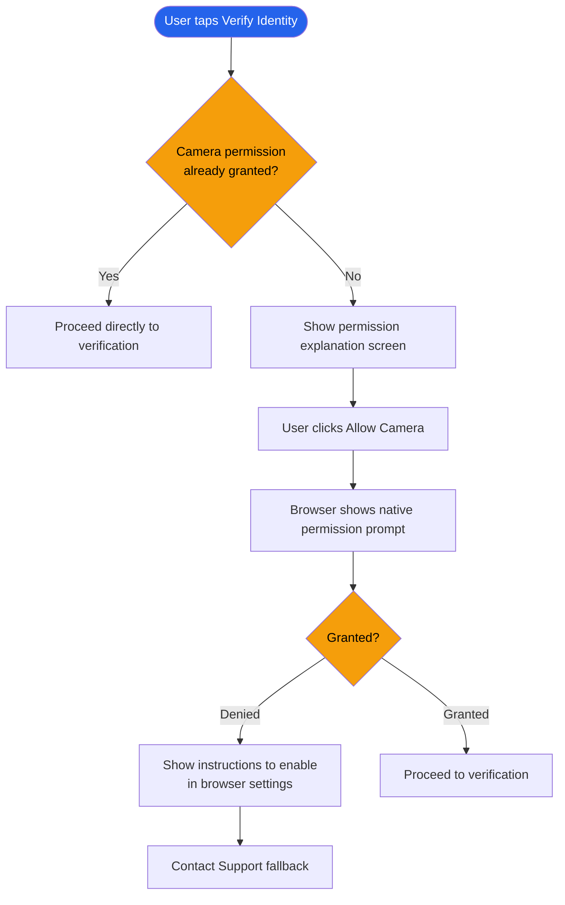

### 6.3 Multi-Strategy Camera Access (from POC)

The existing `ImageCapture.tsx` component already implements a robust camera access strategy:

1. **Enumerate devices** — lists all video inputs, sorts virtual/OBS cameras to bottom
2. **Constraint fallback chain:**
   - Exact device ID (if selected)
   - FacingMode (`user` for selfie) + ideal 1280x720
   - No facingMode + ideal 1280x720
   - 640x480 basic
   - `{ video: true }` as last resort
3. **Selfie mirroring:** `scaleX(-1)` on both video preview and captured canvas
4. **Error handling:** Graceful fallback for camera API unavailability

---

## 7. Ease of Maintenance & Invisible Updates

### 7.1 How Invisible Updates Work

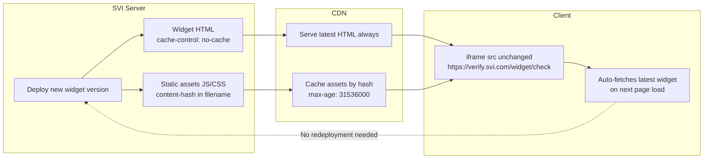

### 7.2 Versioning Strategy

| Component | Versioning | Update Mechanism | Client Impact |
|-----------|-----------|------------------|---------------|
| **Widget HTML** | No version (latest) | CDN cache-bust via `?v=timestamp` | None — always latest |
| **Widget JS/CSS** | Content-hash in filename | New deploy = new hash = auto-fetch | None — transparent |
| **Backend API** | Semantic versioning (`/api/v1/...`) | Backward-compatible additions only | None — v1 stable |
| **Client SDK (optional)** | npm package version | Client updates package.json | Minor — opt-in |
| **postMessage protocol** | Versioned in message envelope | `{version: 1, type: 'SVI_VERIFICATION_COMPLETE', ...}` | None — backward compatible |

### 7.3 Client Integration Checklist

### Required
- [ ] Add our server IP to allowlist (outbound HTTPS to api.svi.com)
- [ ] Add our widget domain to Content-Security-Policy: `frame-src https://verify.svi.com`
- [ ] Add `NSCameraUsageDescription` to iOS Info.plist (if using WebView)
- [ ] Add `<uses-permission android:name="android.permission.CAMERA" />` to Android manifest
- [ ] Implement callback endpoint to receive verification payload
- [ ] Verify HMAC signature on callback payload before processing

### Optional
- [ ] Customize timeout duration (default: 5 minutes)
- [ ] Set custom callback URL per transaction
- [ ] Configure retry limits (default: 3 attempts)
- [ ] Add webhook for failed verification alerts

### Code Changes Required
```html
<!-- Add to transaction page -->
<div id="svi-verify-container"></div>
<script src="https://verify.svi.com/sdk/init.js"></script>
<script>
  SVI.init({
    container: '#svi-verify-container',
    clientId: 'CLIENT-001',
    onVerified: (token) => { /* send to backend */ },
    onFailed: (reason) => { /* show error */ }
  });
</script>
```
---

## 8. Leveraging Existing POC Work

The three completed spikes (CPS-220, CPS-221, CPS-222) provide a mature foundation. The following components are production-ready and can be directly reused:

### 8.1 From CPS-221: Face Matching (Face ID Matcher)

| Component | Status | Reuse in Transaction Auth |
|-----------|--------|--------------------------|
| **InsightFace provider** | Validated (100% accuracy full-res) | Backend face match against enrolled template |
| **AWS Rekognition provider** | Validated (100% accuracy all conditions) | Production cloud option ($0.001/check) |
| **Face++ provider** | Validated (85.2% at 800px, better at full-res) | Budget cloud option ($0.00019/check) |
| **Multi-provider architecture** | Pluggable provider pattern | Swap providers without changing integration |
| **Quality warnings** | Face size, orientation, brightness checks | Pre-filter poor captures before matching |
| **Batch processor** | CSV-driven, multi-threaded | Internal benchmarking and audit tooling |

### 8.2 From CPS-222: Liveness Detection

| Component | Status | Reuse in Transaction Auth |
|-----------|--------|--------------------------|
| **Passive liveness (heuristic)** | 8-metric pixel analysis, $0/check | First line of defense — instant, no user action |
| **Active liveness (browser)** | Head-turn challenges + blink detection | Second line for high-value transactions |
| **Flash liveness** | RGB screen flash response analysis | Third line for suspicious cases |
| **Spoof object detection** | AWS Rekognition DetectLabels | Scans for phone/screen/hand in frame |
| **OpenBiometrics integration** | Proxy endpoint for external liveness | Optional enterprise-grade fallback |

### 8.3 From CPS-220: OCR & ID Type Detection

| Component | Status | Reuse in Transaction Auth |
|-----------|--------|--------------------------|
| **PH ID Type Registry** | 14 ID types (0-13) with cross-referencing | Used during enrollment to classify ID type |
| **AI parsing (GROQ/OpenAI)** | Structured field extraction from OCR text | Extract PII during initial enrollment |
| **AWS Rekognition OCR** | Raw text extraction | ID document text capture |
| **AWS Textract** | Document text detection | Higher-quality OCR for dense text |

### 8.4 Combined Architecture

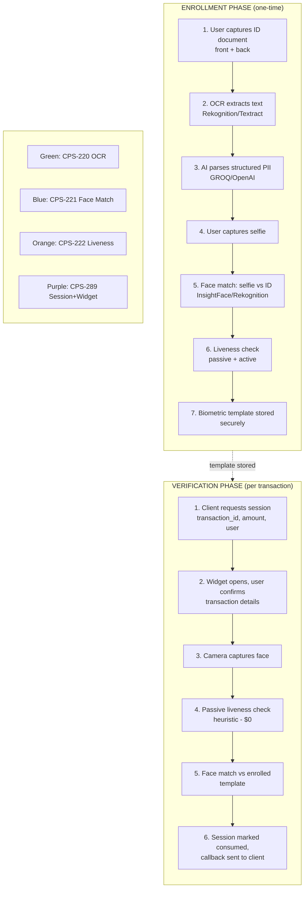

**Color Key:** Green = CPS-220 (OCR), Blue = CPS-221 (Face Match), Orange = CPS-222 (Liveness), Purple = CPS-289 (Session + Widget)

---

## 9. Security Risk Assessment

### 9.1 Threat Model

| Threat | Attack Vector | Likelihood | Impact | Mitigation | Residual Risk |
|--------|--------------|------------|--------|------------|---------------|
| **Photo attack** | Attacker holds up a printed photo of the victim | High | Critical | Passive liveness (texture/FFT/moire analysis) detects flat surface. Spoof object detection catches hand/photo frame. | Low |
| **Video replay** | Attacker plays a video of the victim on a phone/tablet | Medium | Critical | Active liveness (head-turn challenges). Flash liveness (RGB response). Spoof object detection (screen). | Low |
| **Deepfake** | AI-generated face video in real-time | Low | Critical | Active liveness (random challenges unpredictable). Flash liveness (screen response). | Medium |
| **Session hijack** | Attacker steals session_token and uses it from another device | Medium | High | Token bound to user_id. Backend validates user context. Short expiry (5 min). Single-use. | Low |
| **Transaction swap** | Attacker intercepts and modifies transaction details mid-flow | Low | High | Transaction details (amount, recipient) hashed into session token. Displayed in widget for user confirmation. Verified on callback. | Low |
| **Man-in-the-middle** | Attacker intercepts image transmission | Low | High | HTTPS required. Image signed with HMAC. Session token prevents replay. | Low |
| **Callback forgery** | Attacker sends fake verification to client callback endpoint | Medium | High | Callback payload signed with client-specific HMAC secret. Client verifies signature before acting. | Low |
| **Replay attack** | Attacker reuses a previous verification token | Medium | Medium | Single-use tokens (jti consumed after first use). Timestamp validation. | Low |
| **Brute force** | Attacker repeatedly tries to verify with random images | Low | Medium | Rate limiting (3 attempts/session, 10/min per user, 100/min per IP). Account lockout after 5 failed sessions. | Low |
| **Iframe clickjacking** | Attacker overlays fake UI on top of widget | Medium | Medium | `X-Frame-Options: DENY` on widget page. Client must use `frame-src` CSP. Widget detects visibility via `document.visibilityState`. | Low |

### 9.2 Risk Scoring Methodology

| Score | Range | Meaning |
|-------|-------|---------|
| **Critical** | 9-10 | Immediate system compromise, data breach, or financial loss |
| **High** | 7-8 | Significant impact, requires active mitigation |
| **Medium** | 4-6 | Moderate impact, should be addressed |
| **Low** | 1-3 | Minor impact, acceptable residual risk |

### 9.3 Liveness Bypass Risk Assessment

| Attack Method | Passive (heuristic) | Spoof Objects (Rekognition) | Active Challenges | Flash Liveness | Combined |
|---------------|:-------------------:|:---------------------------:|:-----------------:|:--------------:|:--------:|
| **Printed photo** | Detected (texture/FFT) | Detected (hand/photo) | Fails (no movement) | Fails (no flash response) | **99.9%** |
| **Phone screen (video)** | Detected (moire/banding) | Detected (screen) | May pass if video includes movements | Fails (screen response) | **99%** |
| **Tablet screen (video)** | Detected (moire/banding) | May miss (no hand) | May pass | Fails | **95%** |
| **High-quality deepfake** | May pass | Not detected | May pass if trained on challenges | May pass | **70%** |
| **3D mask** | May pass (3D texture) | Not detected | May pass | May pass | **60%** |

> **Note:** For high-value transactions (>P50,000), require **all 4 layers** to pass. For low-value transactions, passive + spoof objects may be sufficient.

---

## 10. Step-by-Step Data Flow Map

### 10.1 Session Creation Flow

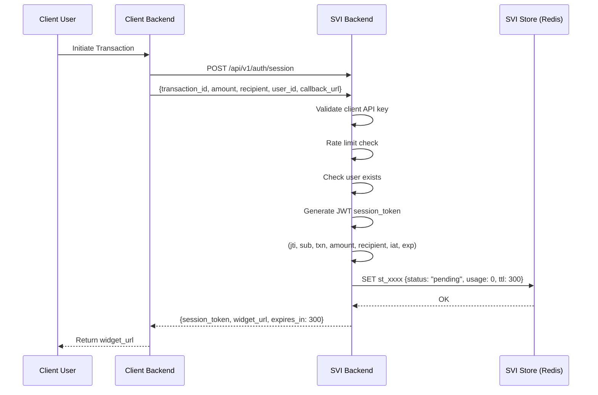

### 10.2 Verification Flow

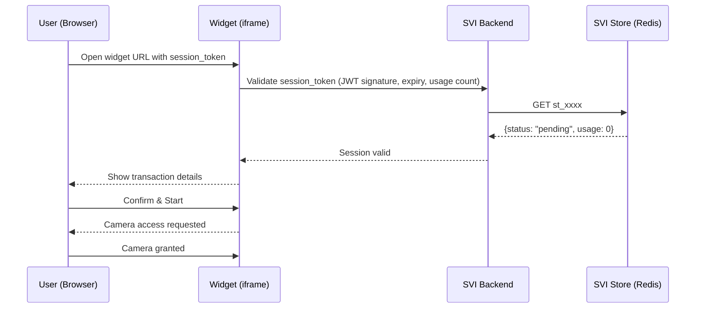

### 10.3 Verification Flow (continued)

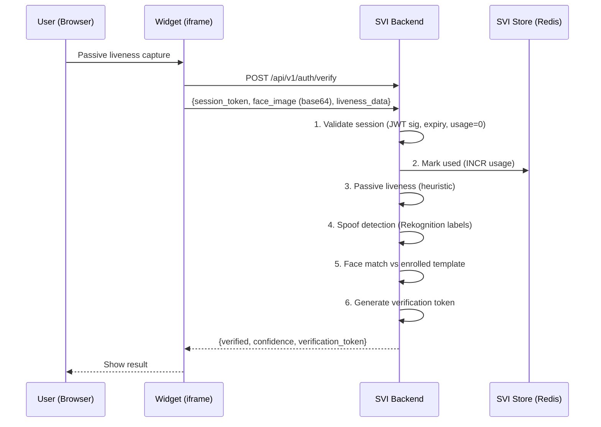

### 10.4 Callback Flow

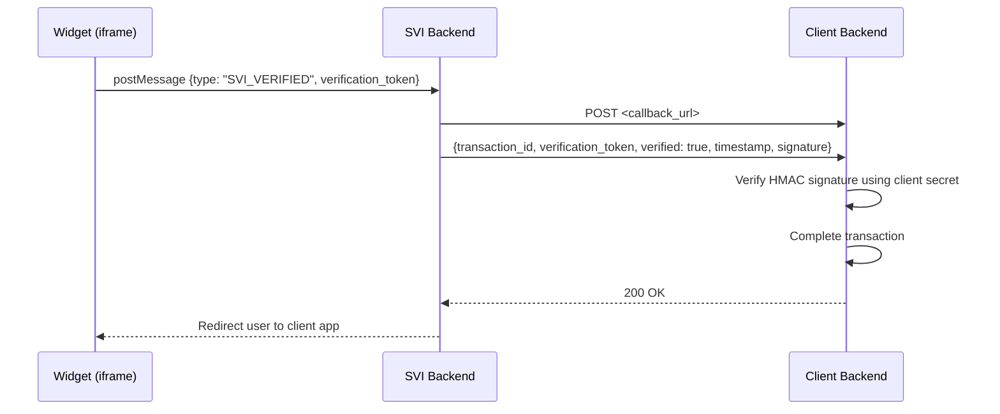

---

## 11. Interactive Prototype Plan

### 11.1 Prototype Scope

A single, self-contained interactive HTML file that simulates the entire biometric transaction authentication experience:

1. **Client transaction page** — shows a "Send Money" button with amount and recipient
2. **Widget launch** — clicking "Verify Identity" opens a modal overlay with the biometric widget
3. **Camera simulation** — simulated camera feed (pre-recorded test video or webcam access)
4. **Liveness simulation** — simulated passive liveness check with progress indicator
5. **Face match simulation** — simulated face comparison with confidence score
6. **Result display** — success/failure with verification token
7. **Callback simulation** — simulated callback to client backend
8. **Transaction completion** — simulated transaction confirmation page

### 11.2 Prototype Architecture

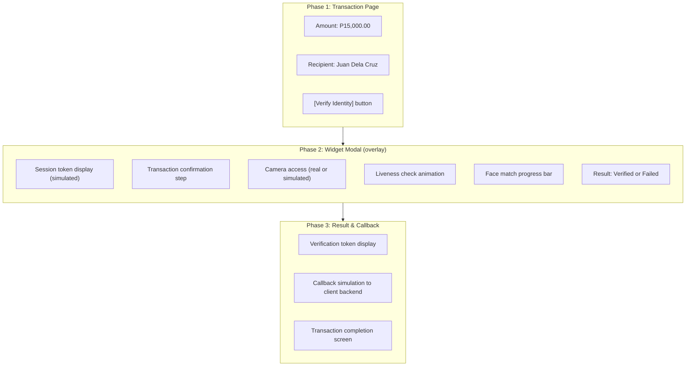

### 11.3 Prototype Implementation Plan

| Phase | Component | What to Build | Est. Effort |
|-------|-----------|---------------|-------------|
| **1** | Transaction page | HTML/CSS for client transaction UI with amount, recipient, verify button | 2 hours |
| **2** | Widget modal | Overlay with iframe simulation, transaction confirmation, camera access | 4 hours |
| **3** | Liveness simulation | Animated liveness check with progress indicator, random pass/fail | 3 hours |
| **4** | Face match simulation | Simulated face comparison with confidence bar, match/no-match result | 2 hours |
| **5** | Callback simulation | postMessage to parent, simulated callback to client backend, transaction completion | 2 hours |
| **6** | Error handling | Timeout, camera denied, liveness failure, retry flow | 2 hours |
| **7** | Polish | Responsive design, mobile-friendly, dark mode, animations | 3 hours |

**Total estimated effort: 17 hours**

### 11.4 Prototype Deliverable

A single `prototype.html` file (with embedded CSS/JS) that:
- Works offline (no external dependencies except CDN fonts)
- Simulates the full flow in ~30 seconds
- Can be opened in any modern browser
- Includes all states: loading, camera, liveness, matching, success, failure, timeout
- Logs all events to console for debugging

---

## 12. Comparison Matrix

### 12.1 Integration Approach Comparison

| Criterion | Iframe Widget | Web Component | Redirect Flow |
|-----------|:-------------:|:-------------:|:-------------:|
| **Security** | Best — sandboxed, no client DOM access | Good — client has DOM access | Best — no cross-origin issues |
| **Integration effort** | Low — one iframe tag | Medium — load SDK script | Low — just a link |
| **UX** | Good — inline modal | Best — native feel | Poor — full page redirect |
| **Mobile WebView** | Needs testing (camera in iframe) | Best — native WebView support | Best — works everywhere |
| **Invisible updates** | Best — server-side only | Good — CDN cache-busting | Best — server-side only |
| **Customization** | None (by design) | Limited (CSS variables) | None |
| **Framework support** | All (just an iframe) | All (vanilla web component) | All (just a URL) |
| **Offline support** | Requires internet | Requires internet | Requires internet |
| **Versioning** | None needed | SDK version management | None needed |

### 12.2 Provider Comparison for Transaction Auth

| Criterion | InsightFace (self-hosted) | AWS Rekognition | Face++ | OpenBiometrics |
|-----------|:------------------------:|:---------------:|:------:|:--------------:|
| **Face match accuracy** | 100% (full-res) | 100% | 85.2% (800px) | 99.4% LFW |
| **Liveness** | Not included | AWS Rekognition Liveness ($0.015/check) | Face++ Liveness ($0.00019/check) | MiniFASNet (passive) + active presets |
| **OCR** | Not included | Rekognition OCR + Textract | Not included | MRZ parsing |
| **Cost per verification** | $0 + server | $0.001 (match) + $0.015 (liveness) = $0.016 | $0.00019 (match) + $0.00019 (liveness) = $0.00038 | $0 + server |
| **Self-hosted** | Yes | Cloud only | Cloud only | Yes (Docker) |
| **PH ID support** | No | Yes (via OCR + AI parsing) | No | MRZ only |
| **Deployment** | Docker/HF Spaces | AWS SDK | REST API | Docker |
| **Best for** | Self-hosted, $0/txn | Production, most robust | Budget cloud | All-in-one OSS |

### 12.3 Session Store Options

| Criterion | Redis | PostgreSQL | Cassandra (existing) |
|-----------|:-----:|:----------:|:-------------------:|
| **TTL expiry** | Native (EXPIRE) | Requires cron job | Requires TTL column |
| **Atomic increment** | INCR (single-use) | UPDATE ... RETURNING | LWT (lightweight transactions) |
| **Latency** | <1ms | 1-5ms | 5-15ms |
| **Existing in SVI** | Not in current stack | Not in current stack | Already used |
| **Persistence** | Configurable (RDB/AOF) | Full ACID | Full ACID |
| **Complex queries** | Limited | Full SQL | CQL only |
| **Best for** | Session cache (fast TTL) | Transaction records | Audit log (existing) |

**Recommendation:** Redis for session tokens (fast TTL, atomic INCR), Cassandra for audit log (existing SVI stack).

---

## 13. POC Plan

### Phase 0: Foundation (COMPLETED — CPS-220, CPS-221, CPS-222)

| Component | Status | Ticket |
|-----------|--------|--------|
| Face matching (InsightFace, Rekognition, Face++) | Done | CPS-221 |
| Liveness detection (passive heuristic, active, flash) | Done | CPS-222 |
| OCR + ID type detection (Rekognition, Textract, AI parsing) | Done | CPS-220 |
| PH ID Type Registry (14 types) | Done | CPS-220 |
| Multi-provider architecture | Done | CPS-221 |
| Camera capture with quality checks | Done | CPS-221 |
| Web app (React + Vite) | Done | CPS-221 |
| FastAPI backend | Done | CPS-221 |

### Phase 1: Session Management API (WEEK 1-2)

- [ ] Design and implement `POST /api/v1/auth/session` endpoint
- [ ] JWT session token generation with HMAC-SHA256 signing
- [ ] Redis session store with TTL and atomic single-use enforcement
- [ ] Rate limiting (per client, per user, per IP)
- [ ] Client API key authentication
- [ ] Session validation middleware

### Phase 2: Widget Frontend (WEEK 3-4)

- [ ] Build standalone widget HTML/JS (no framework dependency)
- [ ] Session validation on widget load
- [ ] Transaction confirmation screen (amount, recipient display)
- [ ] Camera access with multi-constraint fallback (from `ImageCapture.tsx`)
- [ ] Passive liveness check (heuristic — $0, instant)
- [ ] Face capture and submission to backend
- [ ] Result display (success/failure with retry)
- [ ] `postMessage` communication with parent frame
- [ ] Responsive design (mobile-first, 480px max-width)
- [ ] Error states: camera denied, timeout, liveness failure, network error

### Phase 3: Verification API (WEEK 4-5)

- [ ] Implement `POST /api/v1/auth/verify` endpoint
- [ ] Session token validation and single-use enforcement
- [ ] Passive liveness integration (heuristic + AWS Rekognition)
- [ ] Face match against enrolled template (InsightFace/Rekognition)
- [ ] Verification token generation (signed JWT)
- [ ] Callback to client backend with signed payload
- [ ] Audit logging to Cassandra

### Phase 4: Integration & Testing (WEEK 6)

- [ ] Iframe sandbox testing (CSP, permissions, cross-origin)
- [ ] Mobile WebView testing (iOS WKWebView, Android WebView)
- [ ] Camera permission flow testing (granted, denied, revoked)
- [ ] Session timeout and retry flow testing
- [ ] Security penetration testing (OWASP top 10)
- [ ] Load testing (concurrent sessions, rate limiting)
- [ ] Client integration documentation

### Phase 5: Interactive Prototype (WEEK 6-7)

- [ ] Build single-file `prototype.html` with full flow simulation
- [ ] Simulated camera, liveness, face match
- [ ] All states: loading, camera, liveness, matching, success, failure, timeout
- [ ] Responsive design, mobile-friendly
- [ ] Console logging for all events

---

## 14. References

### Existing Spike Reports
- [CPS-220: Auto-Detect ID Type and OCR Extraction](./CPS-220-spike-report.md)
- [CPS-221: Biometric Face Matching (UX vs. Async Backend)](./CPS-221-spike-report.md)
- [CPS-222: Research Non-PhilSys Liveness Detection](./CPS-222-spike-report.md)

### External References
- [OWASP Session Management Cheat Sheet](https://cheatsheetseries.owasp.org/cheatsheets/Session_Management_Cheat_Sheet.html)
- [OWASP JSON Web Token Cheat Sheet](https://cheatsheetseries.owasp.org/cheatsheets/JSON_Web_Token_for_Java_Cheat_Sheet.html)
- [MDN: postMessage API](https://developer.mozilla.org/en-US/docs/Web/API/Window/postMessage)
- [MDN: iframe sandbox attribute](https://developer.mozilla.org/en-US/docs/Web/HTML/Element/iframe#attr-sandbox)
- [W3C: WebRTC getUserMedia](https://w3c.github.io/mediacapture-main/#dom-mediadevices-getusermedia)
- [iOS: Camera access in WKWebView](https://developer.apple.com/documentation/webkit/wkwebview)
- [Android: Camera permission in WebView](https://developer.android.com/training/permissions/requesting)
- [AWS Rekognition Face Liveness](https://docs.aws.amazon.com/rekognition/latest/dg/face-liveness.html)
- [InsightFace: ArcFace Model](https://github.com/deepinsight/insightface)
- [Face++ Liveness Detection API](https://www.faceplusplus.com/liveness-detection/)

---

## Appendix A: API Specification

### A.1 Create Session

```
POST /api/v1/auth/session
Content-Type: application/json
Authorization: Bearer <client_api_key>

{
  "transaction_id": "TXN-20260715-001",
  "amount": 15000.00,
  "currency": "PHP",
  "recipient": "ACC-12345",
  "recipient_name": "Juan Dela Cruz",
  "user_id": "USR-789",
  "callback_url": "https://client.com/api/verify-callback",
  "expires_in": 300,
  "metadata": {
    "ip_address": "192.168.1.1",
    "user_agent": "Mozilla/5.0..."
  }
}

Response 201:
{
  "session_token": "st_eyJhbGciOiJIUzI1NiIsInR5cCI6IkpXVCJ9...",
  "widget_url": "https://verify.svi.com/widget/v1/check?token=st_eyJ...",
  "expires_at": "2026-07-15T14:30:00Z",
  "expires_in": 300
}

Error 429 (rate limited):
{
  "error": "rate_limit_exceeded",
  "retry_after": 60
}

Error 401 (invalid API key):
{
  "error": "unauthorized",
  "message": "Invalid or expired API key"
}
```

### A.2 Submit Verification

```
POST /api/v1/auth/verify
Content-Type: application/json
Authorization: Bearer <client_api_key>

{
  "session_token": "st_eyJ...",
  "face_image": "/9j/4AAQ... (base64 JPEG)",
  "liveness_data": {
    "passive_score": 0.85,
    "spoof_objects": [],
    "active_challenges_passed": true,
    "flash_response_score": 0.92
  },
  "metadata": {
    "user_agent": "Mozilla/5.0...",
    "ip_address": "192.168.1.1",
    "device_info": {
      "screen_width": 390,
      "screen_height": 844,
      "device_pixel_ratio": 3
    }
  }
}

Response 200 (verified):
{
  "verified": true,
  "confidence": 0.97,
  "verification_token": "vt_eyJhbGciOiJIUzI1NiIsInR5cCI6IkpXVCJ9...",
  "matched": true,
  "liveness_passed": true,
  "timestamp": "2026-07-15T14:25:00Z"
}

Response 200 (not verified):
{
  "verified": false,
  "confidence": 0.12,
  "reason": "liveness_check_failed",
  "details": "Passive liveness score 0.32 below threshold 0.70. Spoof objects detected: [phone, screen].",
  "retry_allowed": true,
  "retry_count": 1,
  "max_retries": 3
}

Error 400 (session expired):
{
  "error": "session_expired",
  "message": "Session token expired at 2026-07-15T14:20:00Z"
}

Error 400 (session already used):
{
  "error": "session_already_used",
  "message": "This session token has already been consumed"
}
```

### A.3 Check Session Status

```
GET /api/v1/auth/status?session_token=st_eyJ...
Authorization: Bearer <client_api_key>

Response 200:
{
  "status": "pending",        // pending | verified | failed | expired | cancelled
  "verified": false,
  "expires_at": "2026-07-15T14:30:00Z",
  "attempts": 1,
  "max_attempts": 3
}
```

### A.4 Cancel Session

```
POST /api/v1/auth/cancel
Content-Type: application/json
Authorization: Bearer <client_api_key>

{
  "session_token": "st_eyJ...",
  "reason": "user_cancelled"
}

Response 200:
{
  "cancelled": true,
  "status": "cancelled"
}
```

---

## Appendix B: Widget postMessage Protocol

### B.1 Messages from Widget -> Parent

```typescript
// Verification successful
{
  type: 'SVI_VERIFICATION_COMPLETE',
  version: 1,
  payload: {
    verification_token: 'vt_eyJ...',
    transaction_id: 'TXN-001',
    timestamp: '2026-07-15T14:25:00Z'
  }
}

// Verification failed
{
  type: 'SVI_VERIFICATION_FAILED',
  version: 1,
  payload: {
    reason: 'liveness_check_failed',
    retry_allowed: true,
    attempts_remaining: 2
  }
}

// User cancelled
{
  type: 'SVI_VERIFICATION_CANCELLED',
  version: 1,
  payload: {
    reason: 'user_closed_widget'
  }
}

// Widget loaded and ready
{
  type: 'SVI_WIDGET_READY',
  version: 1,
  payload: {
    session_token: 'st_eyJ...',
    transaction_id: 'TXN-001'
  }
}
```

### B.2 Messages from Parent -> Widget

```typescript
// Close widget
{
  type: 'SVI_CLOSE_WIDGET',
  version: 1
}

// Update session (if token refreshed)
{
  type: 'SVI_UPDATE_SESSION',
  version: 1,
  payload: {
    session_token: 'st_eyJ...'
  }
}
```

---

## Appendix C: Security Headers for Widget

```nginx
# Widget server configuration
server {
    listen 443 ssl;
    server_name verify.svi.com;

    # Security headers
    add_header X-Frame-Options DENY;
    add_header X-Content-Type-Options nosniff;
    add_header X-XSS-Protection "1; mode=block";
    add_header Referrer-Policy no-referrer;
    add_header Permissions-Policy "camera=(self), microphone=()";
    add_header Content-Security-Policy "
        default-src 'self';
        script-src 'self' 'sha256-...';
        style-src 'self' 'unsafe-inline';
        img-src 'self' data: blob:;
        media-src 'self' blob:;
        connect-src 'self' https://api.svi.com;
        frame-ancestors https://*.client.com;
    ";

    # Strict Transport Security
    add_header Strict-Transport-Security "max-age=31536000; includeSubDomains" always;
}
```

---

## Appendix D: Cost Estimation

### D.1 Per-Transaction Cost Breakdown

| Component | Provider | Cost per Check | Notes |
|-----------|----------|---------------:|-------|
| **Passive liveness** | Heuristic (NumPy/PIL) | $0.00 | Self-hosted, no API calls |
| **Spoof object detection** | AWS Rekognition DetectLabels | $0.001 | Only if passive is inconclusive |
| **Active liveness** | Browser-side (face-api.js) | $0.00 | Runs in browser, no server cost |
| **Face matching** | InsightFace (self-hosted) | $0.00 | Or $0.001 for Rekognition |
| **Session management** | Redis | ~$0.00001 | Negligible |
| **Callback** | HTTP POST | ~$0.00001 | Negligible |
| **Total (self-hosted)** | | **$0.001** | Only spoof detection if needed |
| **Total (cloud)** | | **$0.017** | Rekognition match + liveness |

### D.2 Monthly Cost Projections

| Volume | Self-Hosted (InsightFace) | Cloud (Rekognition) | Cloud (Face++) |
|--------|--------------------------:|--------------------:|---------------:|
| 1,000 | ~$1 | ~$17 | ~$0.38 |
| 10,000 | ~$10 | ~$170 | ~$3.80 |
| 100,000 | ~$100 | ~$1,700 | ~$38 |
| 1,000,000 | ~$1,000 | ~$17,000 | ~$380 |

> **Note:** Self-hosted costs are server infrastructure only (compute + storage). Cloud costs include both face matching and liveness.

---

## Appendix E: Glossary

| Term | Definition |
|------|------------|
| **Session Token** | JWT that binds a verification attempt to a specific transaction, user, and client. Single-use, short expiry. |
| **Verification Token** | JWT returned after successful verification. Client sends this to their backend to prove the user was verified. |
| **Widget** | Our hosted web page (iframe) that handles camera capture, liveness check, and face matching. |
| **Callback URL** | Client-provided endpoint that receives the verification result. Payload is HMAC-signed. |
| **Transaction Binding** | The act of cryptographically linking a verification to a specific transaction (amount + recipient). |
| **Passive Liveness** | Liveness detection from a single image — no user action required. Analyzes texture, reflections, etc. |
| **Active Liveness** | Liveness detection requiring user action (head turns, blinks). Harder to spoof but more friction. |
| **Single-Use Token** | A token that becomes invalid after its first use. Prevents replay attacks. |
| **HMAC** | Hash-based Message Authentication Code — used to sign payloads so recipients can verify authenticity. |

---

*See also: `CPS-220-spike-report.md` (OCR & ID Type Detection), `CPS-221-spike-report.md` (Face Matching), `CPS-222-spike-report.md` (Liveness Detection). This spike builds on all three to create a complete biometric transaction authentication solution.*
